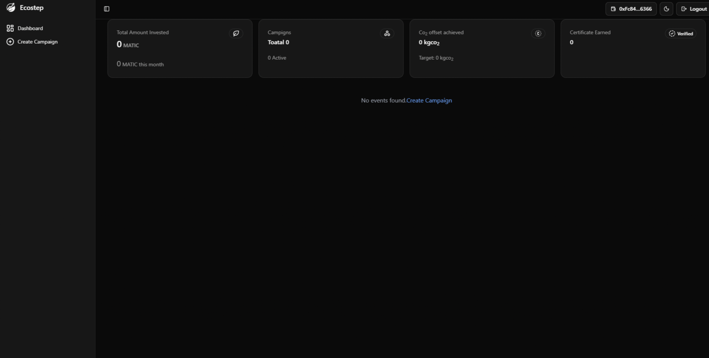
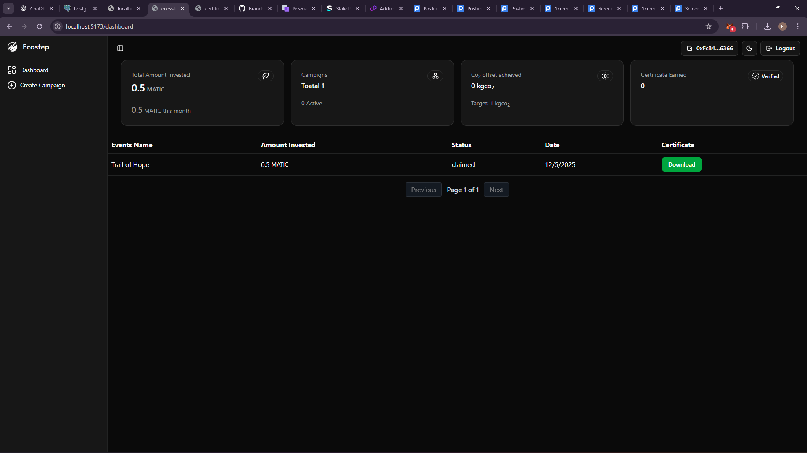
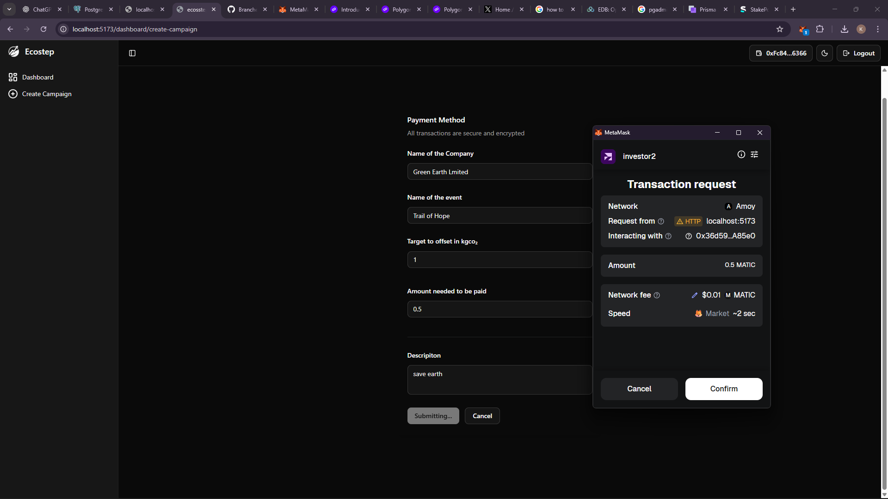
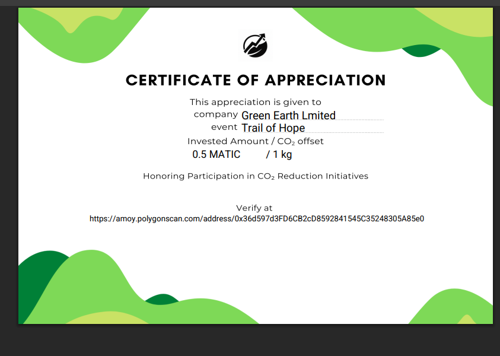

# 💼 Ecostep for Investors

**Ecostep for Investors** is a web application designed to provide investors with a platform to monitor, support, and manage investment opportunities within the Ecostep ecosystem.

The platform gives investors visibility into user goals, investment activity, payment requests, and investment status through a centralized dashboard.

---

## 🚀 Features

* 📊 **Investor Dashboard**
  View an overview of investment-related activity and platform information.

* 👤 **User & Goal Monitoring**
  Review user goals and track their progress.

* 💰 **Investment Management**
  View and manage investment-related activities.

* 💳 **Payment Requests**
  Investors can review payment requests associated with supported goals.

* 📈 **Investment Status**
  Track the current status of investments and supported activities.

* 📜 **Certification**
  Provides certification for investors participating in the Ecostep ecosystem.

* ♻️ **Reusable Components**
  Uses reusable frontend functions and components to keep the application maintainable and scalable.

---

# 🖥️ Screenshots

## Investor Dashboard

<p align="center">
  
</p>

## Dashboard Status

<p align="center">
  
</p>

## Payment Request

<p align="center">
  
</p>

## Investor Certificate

<p align="center">
  
</p>

---

# 🛠️ Tech Stack

* **React** — Frontend UI
* **Vite** — Development server and build tool
* **JavaScript** — Primary programming language
* **Tailwind CSS** — Styling
* **ESLint** — Code quality and linting
* **npm** — Dependency management

---

# 🏗️ Project Structure

```text
Ecostep-for-Investors/
│
├── public/                 # Public/static assets
│
├── src/                    # Main React application source
│
├── Certificate.png        # Investor certificate
├── dashboard.png          # Investor dashboard screenshot
├── dashboardstatus.png    # Dashboard status screenshot
├── paymentRequest.png     # Payment request screenshot
│
├── index.html              # Application HTML entry point
├── package.json            # Project dependencies and scripts
├── package-lock.json       # Locked dependency versions
│
├── vite.config.js          # Vite configuration
├── eslint.config.js        # ESLint configuration
├── tailwind.config.js      # Tailwind CSS configuration
├── jsconfig.json           # JavaScript configuration
├── components.json         # Component configuration
│
└── README.md               # Project documentation
```

---

# 🔄 How It Works

The investor platform provides a centralized interface for investors to interact with the Ecostep ecosystem.

```text
                    Ecostep Platform
                           │
                           ▼
                  Investor Web Application
                           │
             ┌─────────────┼─────────────┐
             │             │             │
             ▼             ▼             ▼
        Dashboard      User Goals    Payment Requests
             │             │             │
             └─────────────┼─────────────┘
                           ▼
                   Investment Status
                           │
                           ▼
                     Certification
```

Investors can use the dashboard to understand the current state of their supported activities and investment-related requests.

---

# 📊 Investor Dashboard

The dashboard provides investors with an overview of important information in one place.

It is designed to make it easier to:

* Monitor investment activity
* Review supported user goals
* Check investment status
* Review payment requests
* Access certification information

---

# 💳 Payment Requests

The platform provides a dedicated interface for handling payment requests.

Investors can review relevant payment information before taking action.

This creates a structured workflow between user goals, investment support, and payment-related activities.

---

# 📜 Investor Certification

Investors participating in the Ecostep ecosystem can receive certification representing their participation.

The platform provides a dedicated certificate view for this purpose.

---

# ⚙️ Getting Started

## Prerequisites

Make sure you have:

* Node.js installed
* npm installed

You can verify your installation with:

```bash
node --version
npm --version
```

---

## Installation

Clone the repository:

```bash
git clone https://github.com/praxjt/Ecostep-for-Investors.git
```

Navigate into the project:

```bash
cd Ecostep-for-Investors
```

Install dependencies:

```bash
npm install
```

---

# ▶️ Running the Application

Start the Vite development server:

```bash
npm run dev
```

Vite will provide a local development URL in the terminal.

Open that URL in your browser to access the investor application.

---

# 🏗️ Production Build

To create a production build:

```bash
npm run build
```

To preview the production build locally:

```bash
npm run preview
```

---

# 🧹 Code Quality

The project uses ESLint to maintain code quality.

Run:

```bash
npm run lint
```

---

# 🔮 Future Improvements

Potential improvements for the investor platform include:

* 📈 Advanced investment analytics
* 📊 Detailed investment history
* 🔔 Real-time payment notifications
* 👥 Improved user and goal management
* 📜 Enhanced investor certification
* 📱 Responsive improvements for mobile devices
* 🔐 Enhanced authentication and authorization
* 📉 Investment performance tracking

---

# 🌱 About Ecostep

Ecostep is an activity-based rewards and investment platform designed to encourage users to stay physically active.

Users complete walking-based activities and earn points, while investors can sponsor users' goals and participate in the incentive ecosystem.

**Ecostep for Investors** provides the investor-facing interface for this ecosystem.

---

# 👨‍💻 Contributors

### Prajwal

[@praxjt](https://github.com/praxjt)

### Krishna Kumara H.

[@Krishnakumarah](https://github.com/Krishnakumarah)

---

# 📄 License

This project is currently intended as part of the Ecostep application ecosystem.
